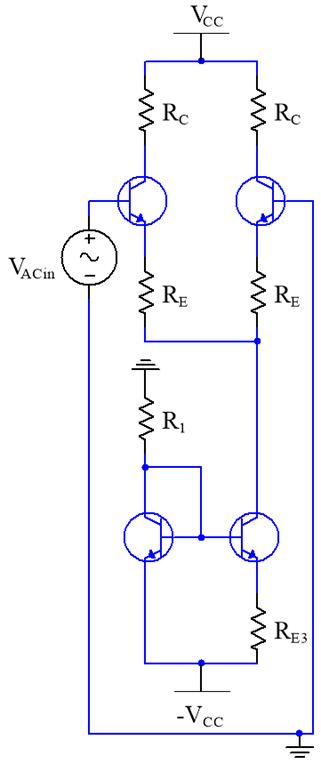
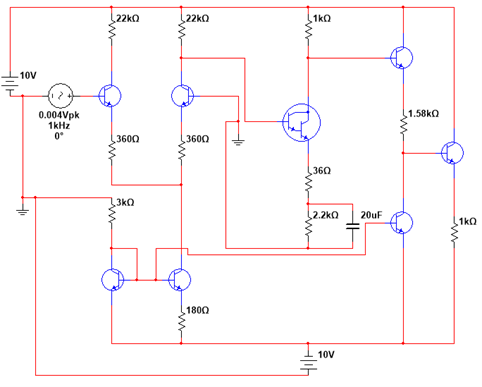
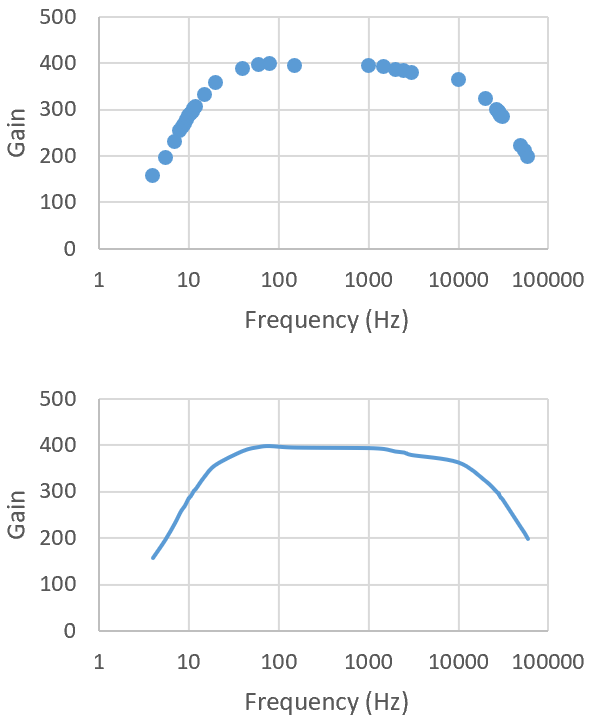
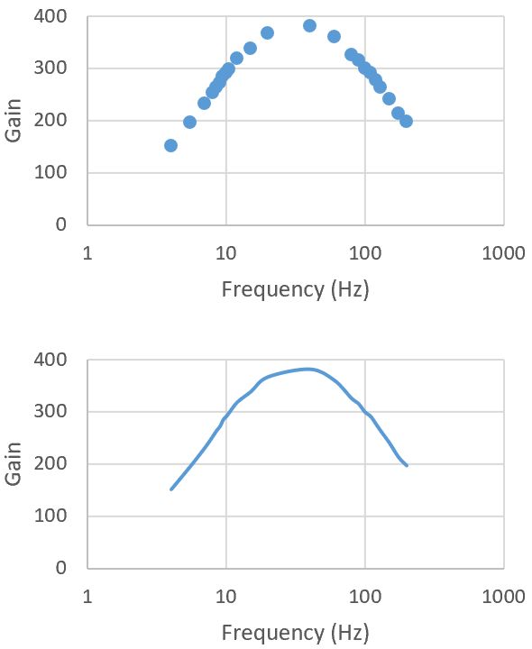
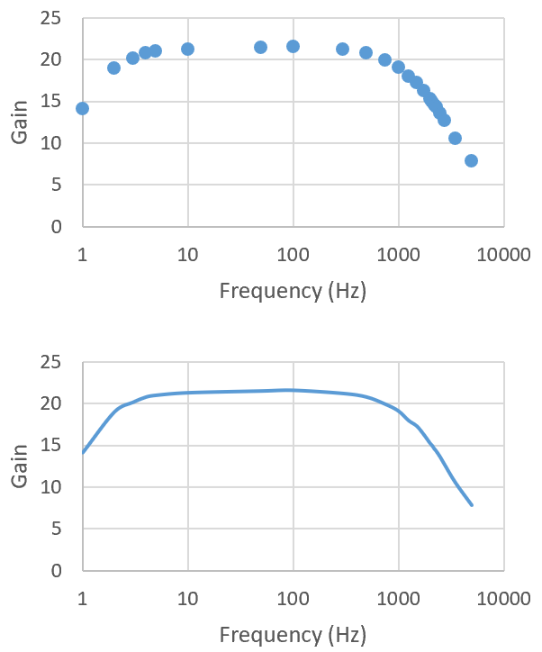

# Discrete Op-Amp Design and Compensation

This project presents the design, analysis, and validation of a discrete operational amplifier built from transistor-level stages. The final system combines a differential input stage, gain stage, output stage, and compensation network into a complete analog amplifier.

## Overview

The goal of this project was to design a discrete op-amp that met analog performance targets while remaining stable under feedback. The work progressed through three connected phases:

1. Differential amplifier design  
2. Full op-amp design  
3. Feedback and compensation  

Together, these phases show how individual analog subsystems were developed into a complete and stable amplifier.

## Project Goals

The design work targeted several key performance requirements across the full system:

- Differential stage voltage gain in the target range
- Full op-amp open-loop gain above 400
- Input resistance of at least 20 kΩ
- Output resistance below 200 Ω
- Stable frequency response under compensation and feedback

## System Architecture

The final op-amp system includes:

- Differential input stage
- Biasing/current-source support
- Gain stage
- Output stage
- Miller compensation and feedback network

## 1. Differential Amplifier

The first stage of the project focused on the design of a transistor-level differential amplifier using a CA3046 transistor array and Widlar current-source biasing.

This stage emphasized:

- Differential voltage gain
- Input resistance
- Common-mode rejection ratio (CMRR)

## 2. Full Discrete Op-Amp

The second stage expanded the differential front end into a complete op-amp system with multiple transistor stages. This design targeted high open-loop gain while maintaining acceptable input and output resistance.

Key results included:

- Total measured gain above 400
- Input resistance above 20 kΩ
- Output resistance below 200 Ω

## 3. Feedback and Compensation

The final stage added negative feedback and Miller compensation to improve stability and shape the frequency response.

This stage included:

- Dominant pole shifting
- Compensation capacitor design
- Closed-loop inverting amplifier behavior
- Comparison of uncompensated and compensated Bode plots

### Uncompensated Response

### Compensated Response

### Compensated Closed-Loop Response

## Files

- `docs/differential-amplifier.pdf` — differential amplifier design and evaluation
- `docs/discrete-opamp-design.pdf` — full op-amp design and measured results
- `docs/opamp-feedback-compensation.pdf` — compensation and feedback analysis

## Skills Demonstrated

- Analog circuit design
- Differential amplifier design
- Biasing and transistor-level analysis
- Multi-stage amplifier design
- Frequency response analysis
- Negative feedback and compensation
- Simulation and measurement comparison
- Technical engineering documentation

## Why This Project Matters

This project shows system-level analog design rather than a single isolated lab. It demonstrates how a differential stage, gain stage, output stage, and compensation network work together to form a complete and stable op-amp.

## Author

Joshua Oliveira
