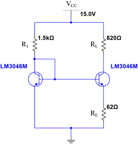

# Discrete Op-Amp Design and Compensation

This project presents the design, analysis, and validation of a discrete operational amplifier built from transistor-level stages. The final system combines a Widlar current source, a differential input stage, a gain stage, an output stage, and compensation/feedback networks into one analog amplifier project.

## Overview

The project was developed across four connected parts:

1. Widlar current source design  
2. Differential amplifier design  
3. Full op-amp design  
4. Negative feedback and frequency compensation  

Together, these stages show the progression from biasing and front-end analog design to a complete and stabilized op-amp.

## Project Goals

The system was designed to demonstrate:

- Stable current-source biasing
- Differential gain and common-mode rejection
- High open-loop gain in a discrete op-amp
- Controlled frequency response through compensation
- Stable closed-loop operation with feedback

## System Architecture

The final op-amp system includes:

- Widlar current source for biasing
- Differential input stage
- Gain stage
- Output stage
- Miller compensation and feedback network

## 1. Widlar Current Source

The biasing foundation for the larger analog system was developed using a Widlar current source. This stage focused on generating a stable current across varying load conditions and analyzing the effect of load resistance on output current and output resistance.

## 2. Differential Amplifier

The next stage built a transistor-level differential amplifier using a CA3046 transistor array and Widlar current-source biasing. This stage emphasized:

- Differential voltage gain
- Input resistance
- Common-mode rejection ratio (CMRR)

## 3. Full Discrete Op-Amp

The full op-amp extended the differential front end into a complete analog system with multiple transistor stages. This design targeted high open-loop gain while maintaining acceptable input and output resistance.

## 4. Feedback and Compensation

The final stage added negative feedback and Miller compensation to improve stability and shape the frequency response. This included:

- Dominant pole shifting
- Compensation capacitor design
- Closed-loop inverting amplifier behavior
- Comparison of uncompensated and compensated Bode plots

### Uncompensated Response

### Compensated Response

### Compensated Closed-Loop Response

## Results Summary

The final project demonstrated:

- Stable current-source biasing with the Widlar configuration
- Differential amplifier gain in the target range with measured CMRR analysis
- Full op-amp gain above 400
- Input resistance above 20 kΩ
- Output resistance below 200 Ω
- Improved stability through compensation and feedback

## Files

- `docs/widlar-current-source.pdf` — current source design and evaluation
- `docs/differential-amplifier.pdf` — differential amplifier design and measured results
- `docs/discrete-opamp-design.pdf` — full op-amp design and measured results
- `docs/opamp-feedback-compensation.pdf` — compensation and feedback analysis

## Skills Demonstrated

- Analog circuit design
- Current-source biasing
- Differential amplifier design
- Transistor-level op-amp design
- Frequency response analysis
- Negative feedback and compensation
- Simulation and measurement comparison
- Technical engineering documentation

## Why This Project Matters

This project shows system-level analog design rather than a single isolated lab. It demonstrates how biasing, differential amplification, gain staging, output behavior, and compensation work together in a complete discrete op-amp system.

## Author

Joshua Oliveira